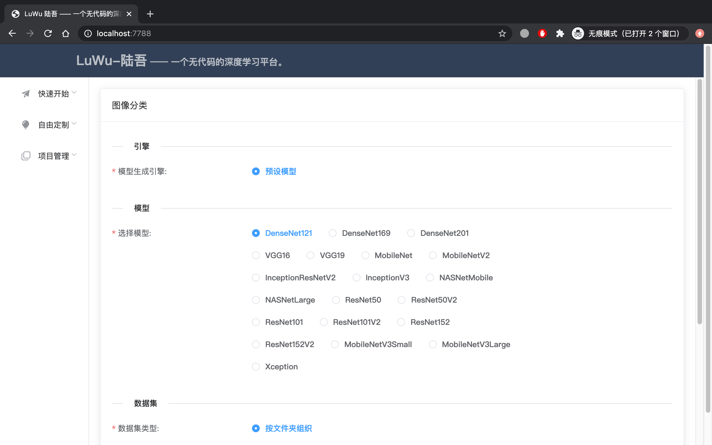
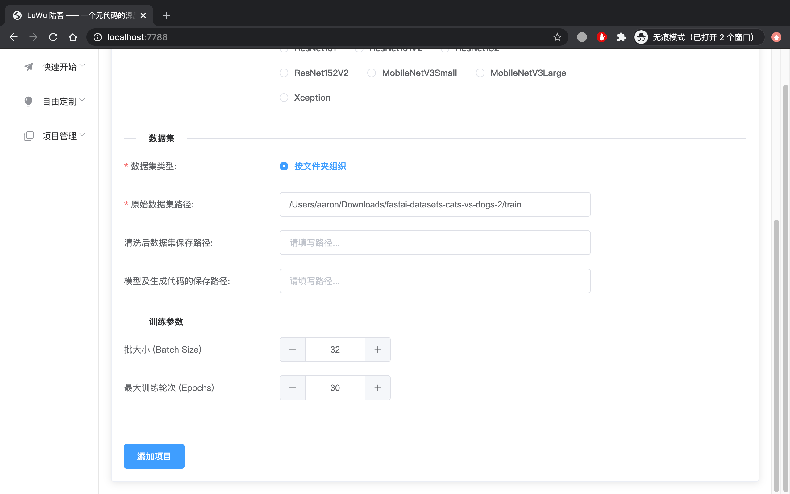
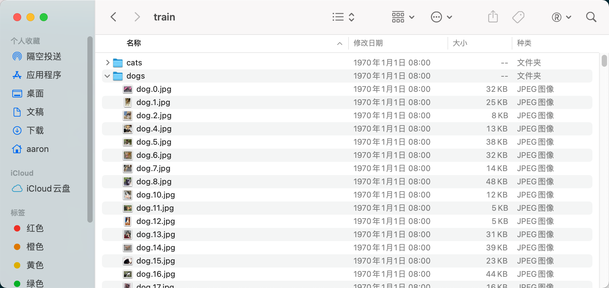
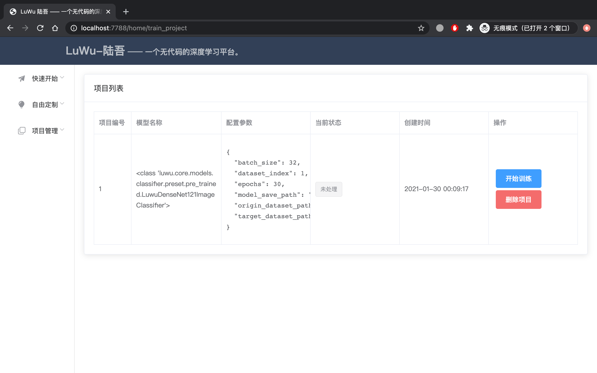
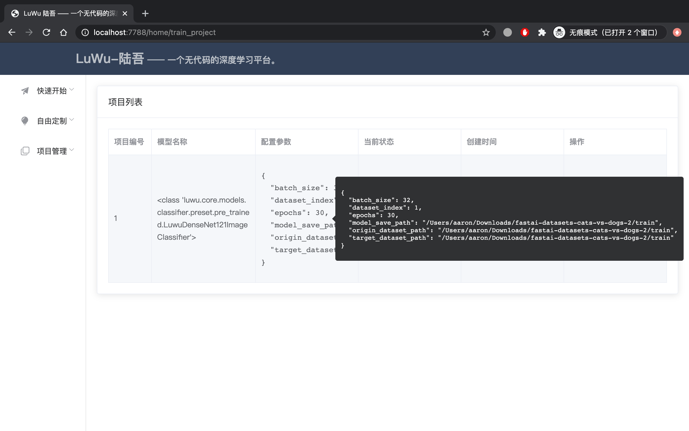
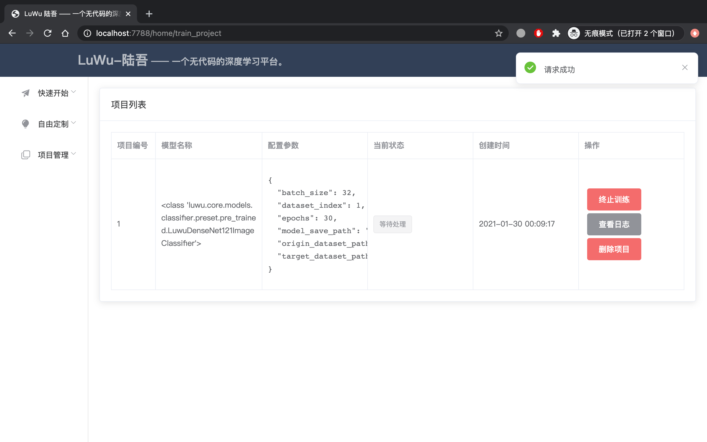
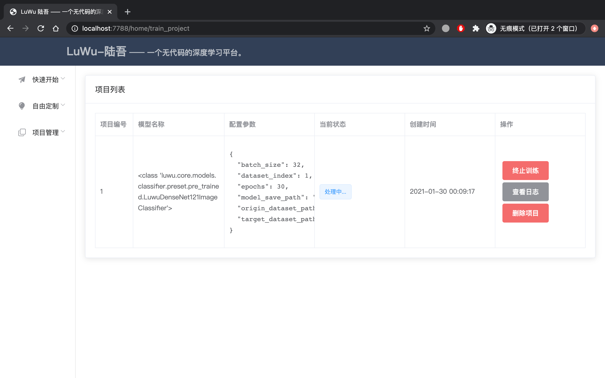
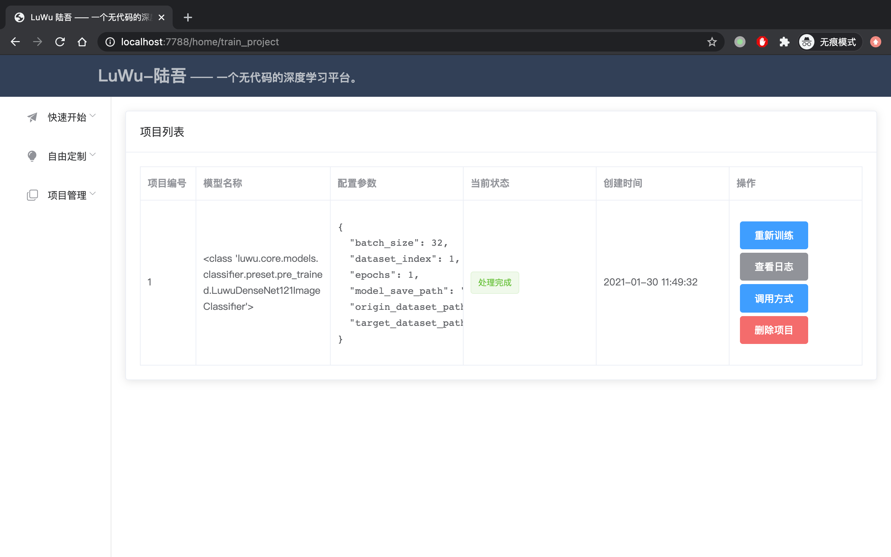
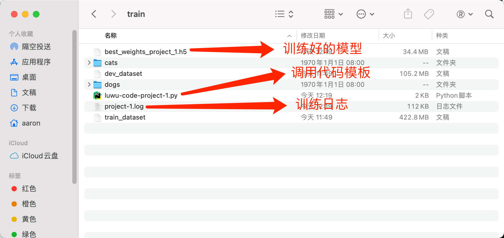
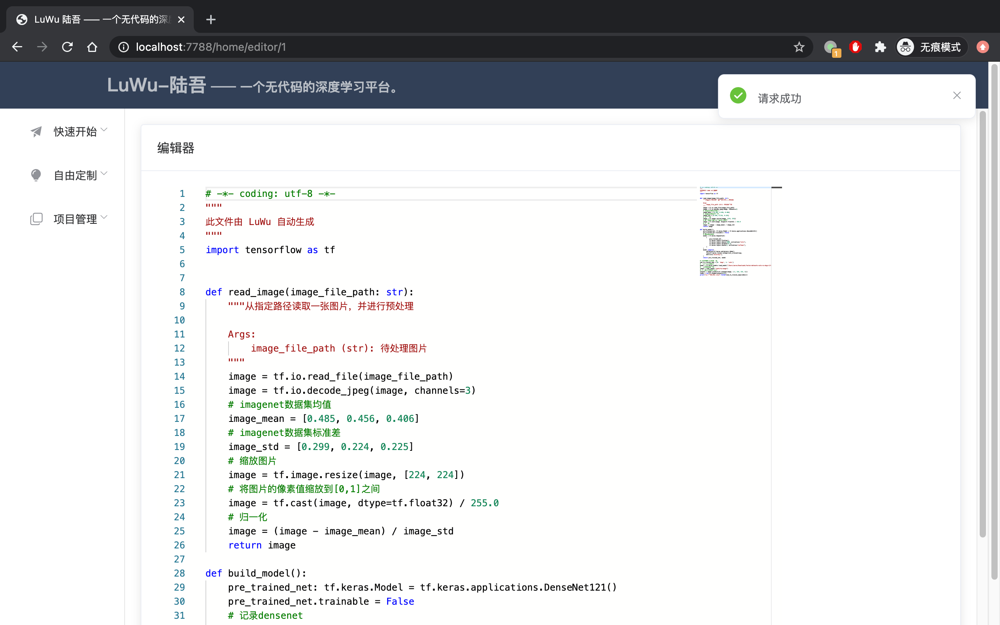

<!--
 * @Author       : AaronJny
 * @LastEditTime : 2021-03-26
 * @FilePath     : /LuWu/README.MD
 * @Desc         : 
-->
<h1 align="center">Welcome to LuWu 陆吾 👋</h1>


-----------

<p>
  </img>
  
  <a href="https://github.com/AaronJny/luwu" target="_blank">
    
  </a>
  <a href="https://github.com/AaronJny/luwu/blob/master/LICENSE" target="_blank">
    
  </a>
  <a></a>
</p>


### 🏠 [Homepage](https://github.com/AaronJny/luwu)


> LuWu——陆吾，一个简单的无代码深度学习平台。

写这个项目的最初动力是:
> 深度学习项目中存在大量重复而繁琐的开发工作，这些低价值的任务不应该浪费我们宝贵的时间，因而萌发了自动化的想法。
> 
> 鼠标点几下就能完成全部开发工作，它不香嘛？

这个项目的诉求是：
> - 使无深度学习相关背景的开发人员也能轻松完成深度学习任务开发
> 
> - 使深度学习开发人员能够更快、更简单地完成一般深度学习任务


模型都自己写嘛？
> 不是，至少不全是。
> 
> `陆吾` 希望成为一个无代码的深度学习平台，其核心在于怎么无代码进行深度学习上。故，模型编写很重要，但不是最重要的，众多模型开发工作量很大，一切以平台功能为优先。
> 
> 所以，模型**有好的轮子就用现成的轮子，没有合适的轮子就自己造**。
> 
> PS：模型编写不是最重要的 **!=** 模型编写不重要

项目使用TensorFlow作为后端。

当前项目只是一个勉强可以运行的超简陋版本，等待持续迭代……

功能规划（只是一个大概的规划，用于引导项目前进，持续调整中……）：

- 任务类型
  - [x] 分类任务
    - [x] 图像分类
    - [ ] 文本分类
    - [ ] 时间序列分类
  - [ ] 回归任务
    - [ ] 图像回归
    - [ ] 文本回归
    - [ ] 时间序列回归
  - [x] 综合场景任务
    - [x] 图像类
      - [x] 目标检测
        - [x] 集成 TensorFlow Object Detection API
      - [ ] 语义分割
      - [ ] 实体分割
    - [ ] 文本类
      - [ ] 命名实体识别
      - [ ] 关系抽取
      - [ ] 文本生成
    - [ ] 时间序列
      - [ ] 序列标注
  - [ ] 搭积木式拖拽自由定制模型
- [x] 模型引擎
  - [x] 预设模型（也就是提前写好的、固定的模型）
  - [ ] 半自动化的网络结构搜索
    - [ ] KerasTuner
    - [ ] NNI 
  - [ ] 全自动的网络结构搜索
    - [ ] AutoKeras
- [x] 架构和辅助功能
  - [x] 任务进程调度模块（乞丐版）
  - [x] Web交互 (乞丐版，坐等前端和UI大佬用爱发电)
  - [x] 数据集组织方式
    - [x] 图像分类 
      - [x] 按文件夹组织（每一个类别的图片放在一个单独文件夹下，这些文件夹又放在同一个文件夹下）
      - [ ] 以路径+类别的文本文件组织
    - [ ] 文本分类
      - [ ] [doccano](https://github.com/doccano/doccano)的导出格式
        - [ ] csv
        - [ ] jsonl
    - [ ] 更多...
  - [x] 代码生成
    - [x] 生成简单的调用示例脚本
    - [ ] 生成可用于生产环境部署的项目
  - [ ] 训练进度提示和指标展示
  - [x] 在线查看训练日志
  - [ ] 训练优化
    - [ ] EarlyStopping
    - [ ] 迁移学习解冻特征抽取器做二次 Fine turn
    - [ ] 自动样本均衡
    - [ ] 增加简单的过拟合调节参数
  - [x] 命令行工具
    - [x] 图像分类任务的命令行支持
    - [x] 目标检测任务的命令行支持
  - [x] 使用 Kaggle 运行（对于没有靠谱的计算设备的小伙伴，可以使用此功能白嫖Kaggle的GPU进行训练~ 感谢Kaggle,美滋滋~）


**注意**：
> 暂时搁置 Web 页面上相关的功能开发，主要精力投入到命令行工具开发和模型功能开发上。
> 
> 因为，我忽然发现，直接使用命令行工具貌似比使用 Web 服务更方便 ...

### ✨ [Demo](https://github.com/AaronJny/luwu)

- [一、[基本使用]安装Luwu](docs/一、[基本使用]安装Luwu.md)
- [二、[基本使用]了解Luwu的命令行模式](docs/二、[基本使用]了解Luwu的命令行模式.md)
- [三、[图像分类]训练一个图像分类器](docs/三、[图像分类]训练一个图像分类器.md)
- [四、[目标检测]使用LabelImg标注数据集](docs/四、[目标检测]使用LabelImg标注数据集.md)
- [五、[目标检测]训练一个目标检测模型](docs/五、[目标检测]训练一个目标检测模型.md)
- [六、[进阶用法]使用Kaggle加速训练](docs/六、[进阶用法]使用Kaggle加速训练.md)

## 运行项目

当前支持三种运行方式，使用 `pip` 、 `Docker` 或 `Clone` 项目代码。

**建议使用Anaconda管理Python环境**。

如果没有安装Anaconda，可以先自行安装。下载链接：[https://www.anaconda.com/products/individual#Downloads](https://www.anaconda.com/products/individual#Downloads)

### 使用 `pip` 安装

使用 Anaconda :

```sh
conda create -n luwu python=3.7
conda activate luwu
pip install luwu
luwu -h
```

不使用 Anaconda :

```sh
pip3 install luwu
luwu -h
```

### Clone 项目代码


使用 Anaconda：

```sh
conda create -n luwu python=3.7
conda activate luwu
git clone https://github.com/AaronJny/luwu.git
cd luwu
python setup.py install
luwu -h
```

不使用 Anaconda：

```sh
git clone https://github.com/AaronJny/luwu.git
cd luwu
python3 setup.py install
luwu -h
```

### 使用 Docker 运行

陆吾支持通过Docker运行，提供 `CPU` 和 `GPU` 两种运行环境。

首先，请需要安装好 `Docker`。没有安装的话，可以参考 [https://www.runoob.com/docker/ubuntu-docker-install.html](https://www.runoob.com/docker/ubuntu-docker-install.html)进行安装。

使用 `CPU` :

```sh
# 拉取最新镜像
docker pull aaronjny/luwu:latest
# 运行容器
docker run --name luwu -p 7788:7788 -v /home/xxx/data:/data aaronjny/luwu
```

使用 `GPU` :

`GPU`版本`Docker`镜像仅支持`Linux`系统。

如果要使用 `GPU` 版本的镜像，则需要：

1.在本机安装 Nvidia 显卡设备对应的最新版本的驱动

2.如果没有安装 `nvidia-container-toolkit`，需要先在本机安装 `nvidia-container-toolkit`。具体安装参考[https://nvidia.github.io/nvidia-docker/](https://nvidia.github.io/nvidia-docker/)。

以 `Debian` 系统的安装为例：

```sh
curl -s -L https://nvidia.github.io/nvidia-docker/gpgkey | \
  sudo apt-key add -
distribution=$(. /etc/os-release;echo $ID$VERSION_ID)
curl -s -L https://nvidia.github.io/nvidia-docker/$distribution/nvidia-docker.list | \
  sudo tee /etc/apt/sources.list.d/nvidia-docker.list
sudo apt-get update
sudo apt-get install nvidia-container-toolkit
```

对于使用 `Deepin` 的朋友，可以使用如下的指令安装：

```sh
distribution="debian10"
curl -s -L https://nvidia.github.io/nvidia-docker/gpgkey | \
  sudo apt-key add -
curl -s -L https://nvidia.github.io/nvidia-docker/$distribution/nvidia-docker.list | \
  sudo tee /etc/apt/sources.list.d/nvidia-docker.list
sudo apt-get update
sudo apt-get install nvidia-container-toolkit
```

3.拉取并运行`GPU`版本容器。

```sh
docker pull aaronjny/luwu:gpu
# 运行容器
docker run --name luwu --gpus all -p 7788:7788 -v /home/xxx/data:/data aaronjny/luwu:gpu
```

## 使用说明

### 一、以 Web 服务的方式使用陆吾

> 当前陆吾的 Web 服务仅支持图像分类任务。其他任务等待适配...

1.按照上面的说明之一，将陆吾安装好。

在命令行中使用指令 `luwu web-server` 启动 `Web` 服务。

项目默认运行在 7788 端口，在浏览器中打开 [http://localhost:7788/](http://localhost:7788/) 即可进入项目主页。

项目主页当前默认为图像分类页面。


2.选择模型引擎，当前只支持预设模型。

选择后会展开该引擎支持的模型列表。



图中的这些模型主要都是对tf.keras.applications下的模型的封装，支持使用少量样本做迁移学习。

模型默认选中 `DenseNet121`，你也可以换成其他想使用的模型。

3.配置数据集路径和训练参数



数据集类型当前只支持“按文件夹组织”，即每一个类别的图片放在一个单独文件夹下，这些文件夹又放在同一个文件夹下，比如我这里的猫狗分类数据集：



`陆吾` 在进行模型训练前，会先尝试将原始数据集转成TFRecordDataset的格式，并切分验证集。

页面中的“清洗后数据集保存路径”即为保存转换后的TFRecordDataset格式的数据集的路径，只需要指定放在哪个文件夹下即可。

如果不填写，默认与“原始数据集路径”保持一致。

训练过程中，`陆吾` 会保存训练过程中的当前最佳模型参数、日志文件，并在训练完成后生成调用代码模板。

这些文件将被保存到页面上“模型及生成代码的保存路径”中填写的文件夹下。

如果不填写，默认与“清洗后数据集保存路径”保持一致。

再下面是两项配置：
- Batch Size，表示训练时mini batch 的大小，即一次训练几个样本
- Epochs，即最多在训练集上进行几次完整遍历

如果不清楚这两项的作用，可以先不调整它，并以如下原则为指导：
- 当训练过程中内存溢出时，请选择更小的Batch Size
- 当训练完成后，训练效果不够好时，可以选择更大的 Epochs

如果只是想体验一下，可以将Epochs设为1或2，这样可以更快看到结果。

为什么可以选择的参数这么少？
> 为了简单。

这样不是牺牲了灵活性吗？
> 是的。后面会考虑怎么在开放更多可配置参数满足灵活性需求的同时，也不会对新手玩家造成干扰。

然后点击“添加项目”即可，将自动跳转到项目列表页面。

4.项目列表

我们可以在项目列表看到刚刚创建的项目。



鼠标移动到“配置参数”上，可以展开详情：



点击“开始训练”按钮，项目会进入调度，开始训练：





一段时间后，训练完成。



我们可以在“模型及生成代码的保存路径”中找到训练日志、训练好的模型文件以及调用代码模板。



你也可以在浏览器中，点击“调用方式”在线浏览调用代码模板。



使用说明就到这里了，训练好的模型和调用方法都给你了，还要啥自行车？


### 二、以命令行工具的方式使用陆吾

> 当前陆吾的命令行工具仅支持如下功能：
> - 启动 Web 服务
> - 执行目标检测任务
> - 执行图像分类任务

查看陆吾支持的功能:

```sh
luwu -h
```

output:

```
usage: luwu [-h] {web-server,detection} ...

Luwu命令行工具。 你完全可以不写任何代码，就能够完成深度学习任务的开发。 LuWu command tool. You can complete the
development of deep learning tasks without writing any code.

optional arguments:
  -h, --help            show this help message and exit

cmd:
  命令参数，用以指定 Luwu 将要执行的操作

  {web-server,detection}
    web-server          以web服务的形式启动Luwu，从而通过图形界面完成深度学习任务的开发。
    detection           通过命令行进行目标检测任务训练。
```

启动 Web 服务：

```sh
luwu web-server
```

训练一个目标检测任务：

```sh
luwu detection -h
```

output:

```
usage: luwu detection [-h] [--origin_dataset_path ORIGIN_DATASET_PATH]
                      [--tfrecord_dataset_path TFRECORD_DATASET_PATH]
                      [--label_map_path LABEL_MAP_PATH]
                      [--do_fine_tune DO_FINE_TUNE]
                      [--fine_tune_checkpoint_path FINE_TUNE_CHECKPOINT_PATH]
                      [--fine_tune_model_name FINE_TUNE_MODEL_NAME]
                      [--model_save_path MODEL_SAVE_PATH]
                      [--batch_size BATCH_SIZE] [--steps STEPS]
                      [--project_id PROJECT_ID]
                      [--run_with_kaggle RUN_WITH_KAGGLE]
                      [--kaggle_accelerator KAGGLE_ACCELERATOR]

optional arguments:
  -h, --help            show this help message and exit
  --origin_dataset_path ORIGIN_DATASET_PATH
                        处理前的数据集路径
  --tfrecord_dataset_path TFRECORD_DATASET_PATH
                        处理后的tfrecord数据集路径
  --label_map_path LABEL_MAP_PATH
                        目标检测类别映射表(pbtxt)
  --do_fine_tune DO_FINE_TUNE
                        是否在预训练模型的基础上进行微调
  --fine_tune_checkpoint_path FINE_TUNE_CHECKPOINT_PATH
                        预训练权重路径
  --fine_tune_model_name FINE_TUNE_MODEL_NAME
                        预训练模型名称。可选值的列表为["SSD ResNet50 V1 FPN 640x640
                        (RetinaNet50)","EfficientDet D0 512x512","CenterNet
                        Resnet101 V1 FPN 512x512","CenterNet HourGlass104
                        512x512"]
  --model_save_path MODEL_SAVE_PATH
                        模型保存路径
  --batch_size BATCH_SIZE
                        mini batch 大小。默认 8.
  --steps STEPS         训练steps数量. Defaults to 2000.
  --project_id PROJECT_ID
                        项目编号. Defaults to 0.
  --run_with_kaggle RUN_WITH_KAGGLE
                        是否使用kaggle环境运行。必须先安装并配置kaggle
                        api,才可以使用此选项。默认为False，即本地运行
  --kaggle_accelerator KAGGLE_ACCELERATOR
                        是否使用kaggle GPU进行加速（注意，仅当 run_with_kaggle 为 True
                        时此选项才有效）。默认不使用（即使用CPU）
```

训练一个图像分类任务：

```sh
luwu classification -h
```

output:

```
usage: luwu classification [-h] [--origin_dataset_path ORIGIN_DATASET_PATH]
                           [--tfrecord_dataset_path TFRECORD_DATASET_PATH]
                           [--model_save_path MODEL_SAVE_PATH]
                           [--validation_split VALIDATION_SPLIT]
                           [--do_fine_tune DO_FINE_TUNE]
                           [--batch_size BATCH_SIZE] [--epochs EPOCHS]
                           [--project_id PROJECT_ID]
                           [--run_with_kaggle RUN_WITH_KAGGLE]
                           [--kaggle_accelerator KAGGLE_ACCELERATOR]
                           network_name

positional arguments:
  network_name          分类器名称，支持的分类器有：[LuwuDenseNet121ImageClassifier, LuwuDen
                        seNet169ImageClassifier,LuwuDenseNet201ImageClassifier
                        , LuwuVGG16ImageClassifier,LuwuVGG19ImageClassifier,Lu
                        wuMobileNetImageClassifier, LuwuMobileNetV2ImageClassi
                        fier,LuwuInceptionResNetV2ImageClassifier, LuwuIncepti
                        onV3ImageClassifier,LuwuNASNetMobileImageClassifier, L
                        uwuNASNetLargeImageClassifier,LuwuResNet50ImageClassif
                        ier, LuwuResNet50V2ImageClassifier,LuwuResNet101ImageC
                        lassifier, LuwuResNet101V2ImageClassifier,LuwuResNet15
                        2ImageClassifier, LuwuResNet152V2ImageClassifier,LuwuM
                        obileNetV3SmallImageClassifier, LuwuMobileNetV3LargeIm
                        ageClassifier,LuwuXceptionImageClassifier, LuwuEfficie
                        ntNetB0ImageClassifier,LuwuEfficientNetB1ImageClassifi
                        er, LuwuEfficientNetB2ImageClassifier,LuwuEfficientNet
                        B3ImageClassifier, LuwuEfficientNetB4ImageClassifier,L
                        uwuEfficientNetB5ImageClassifier, LuwuEfficientNetB6Im
                        ageClassifier,LuwuEfficientNetB7ImageClassifier]

optional arguments:
  -h, --help            show this help message and exit
  --origin_dataset_path ORIGIN_DATASET_PATH
                        处理前的数据集路径
  --tfrecord_dataset_path TFRECORD_DATASET_PATH
                        处理后的tfrecord数据集路径
  --model_save_path MODEL_SAVE_PATH
                        模型保存路径
  --validation_split VALIDATION_SPLIT
                        验证集切割比例。默认 0.2
  --do_fine_tune DO_FINE_TUNE
                        是进行fine tune，还是重新训练。默认 False
  --batch_size BATCH_SIZE
                        mini batch 大小。默认 32.
  --epochs EPOCHS       训练epoch数。默认 30.
  --project_id PROJECT_ID
                        项目编号. Defaults to 0.
  --run_with_kaggle RUN_WITH_KAGGLE
                        是否使用kaggle环境运行。必须先安装并配置kaggle
                        api,才可以使用此选项。默认为False，即本地运行
  --kaggle_accelerator KAGGLE_ACCELERATOR
                        是否使用kaggle GPU进行加速（注意，仅当 run_with_kaggle 为 True
                        时此选项才有效）。默认不使用（即使用CPU）
```

## Code Contributors

饭碗已摆好，坐等各路大佬贡献代码~

不过大佬们应该也看不上我这弱鸡项目(卑微.jpg)……

## Author

👤 **AaronJny**

* Website: https://blog.csdn.net/aaronjny
* Github: [@AaronJny](https://github.com/AaronJny)


## 🤝 Contributing

使用中出现什么问题，或者有什么建议，都欢迎在项目里发起 [issues](https://github.com/AaronJny/luwu/issues)。

另外欢迎有兴趣的大佬们贡献代码，共同开发~

Contributions, issues and feature requests are welcome!<br />Feel free to check [issues page](https://github.com/AaronJny/luwu/issues). You can also take a look at the [contributing guide](https://github.com/AaronJny/luwu).

## Show your support

如果这个项目对你有所帮助的话，麻烦给点个 star ⭐️ 哈~

多谢多谢~

Give a ⭐️ if this project helped you!

## 📝 License

Copyright © 2021 [AaronJny](https://github.com/AaronJny).<br />
This project is [MIT](https://github.com/AaronJny/luwu/blob/master/LICENSE) licensed.

***
_This README was generated with ❤️ by [readme-md-generator](https://github.com/kefranabg/readme-md-generator)_