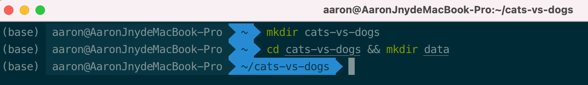
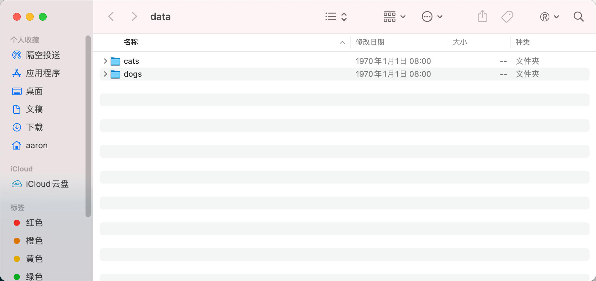
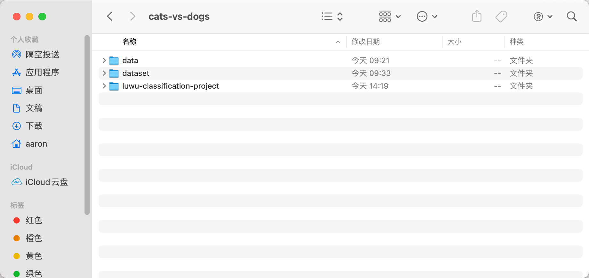
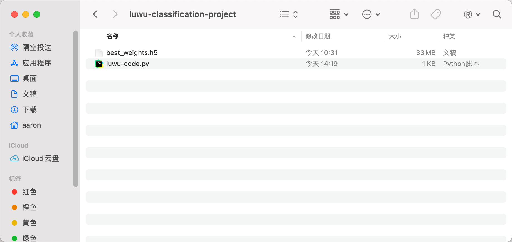
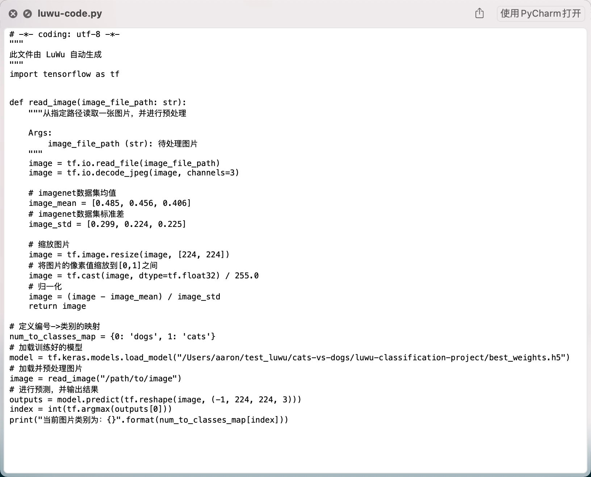

<!--
 * @Author       : AaronJny
 * @LastEditTime : 2021-03-19
 * @FilePath     : /LuWu/docs/三、[图像分类]训练一个图像分类器.md
 * @Desc         : 
-->
# 三、[图像分类]训练一个图像分类器


我们使用猫狗分类的数据集做图像分类演示。


## 1.下载数据集

数据集可以从这里下载：[https://www.floydhub.com/fastai/datasets/cats-vs-dogs](https://www.floydhub.com/fastai/datasets/cats-vs-dogs)

下载后解压即可。

因为只是做演示，所以我们就不适用完整数据集了，仅使用数据集中`train`部分。

## 2.创建项目文件夹

我们需要创建一个文件夹作为工作目录。

打开终端，输入`mkdir cats-vs-dogs`，创建工作目录。

输入`cd cats-vs-dogs && mkdir data`，创建一个data目录，用于存放原始数据集。



## 3.复制/移动数据集到项目文件夹下

接下来，打开`cats-vs-dogs/data`文件夹，将下载的数据集中的`train`文件夹下的子文件夹复制到`cats-vs-dogs/data`文件夹下。



## 4.通过`luwu`的命令行工具训练图像分类器

打开终端，将当前目录切换到`cats-vs-dogs`下，然后输入命令：

```sh
luwu classification --origin_dataset_path ./data --tfrecord_dataset_path ./dataset --model_save_path . --epochs 10 --validation_split 0.05 --do_fine_tune True  LuwuDenseNet121ImageClassifier
```

这里解释一下命令中的参数：

- luwu : luwu命令行工具入口
- classification : 训练一个分类任务
- --origin_dataset_path : 原始数据集的路径。数据集的组织方式有要求，需要以类别作为文件夹名称、图片放在对应文件夹下。举个例子，这里的`origin_dataset_path`是`./data`，`./data`下有两个文件夹`cats`和`dogs`分别代表两个类别，所有猫的图片都放在`cats`文件夹下，所有狗的图片都放在`dogs`文件夹下。
- --tfrecord_dataset_path : 模型训练之前，数据集会被先转换成`TFRecord`格式的文件，这个目录表示生成的`TFRecord`文件存放的位置。举个例子，这里的`tfrecord_dataset_path`是`./dataset`，生成的文件将放在此目录下（如果该目录不存在则会自动创建）。
- --model_save_path : 表示训练好的模型、和生成的调用代码等文件存放的目录。这里的`model_save_path`是`.`，表示存放在当前目录下。
- --epochs : 表示在数据集上进行多少次完整迭代，这里`epochs`为10，表示遍历完整数据集10次。
- --validation_split : 训练过程中，数据集将被划分成训练集和验证集，此参数表示划分验证集的比例。这里的`validation_split`为0.05，表示有约5%的数据用于模型验证。
- --do_fine_tune : 表示在训练过程中是否先冻结预训练模型进行 fine tune.当此参数为`True`时，先冻结预训练模型的权重训练 $$epochs/2$$ 个epochs（向下取整）,再解冻全部参数训练完剩下的 epochs。否则，解冻全部参数训练所有epochs。这里的`do_fine_tune`为`True`，`epochs`为10，表示先冻结训练5个epochs，再解冻训练5个epochs。
- LuwuDenseNet121ImageClassifier : 分类器模型名称。这是luwu支持的模型之一，更多模型可以通过在命令行中执行`luwu classification -h`查看。（这么多模型如何选择？后面再补说明吧）

注意，路径相关的参数其实传绝对路径会更合适，能够减少人为引入的路径错误问题。不过为了方便演示，我这里使用了相对路径。
  

更多的可配置参数也可以通过在命令行中执行`luwu classification -h`查看。

言归正传，输入上面的命令后，luwu将开始训练一个图像分类器，大致输出如下：

```
Namespace(batch_size=8, cmd='classification', do_fine_tune=True, epochs=10, kaggle_accelerator=False, model_save_path='/Users/aaron/cats-vs-dogs', network_name='LuwuDenseNet121ImageClassifier', origin_dataset_path='/Users/aaron/cats-vs-dogs/data', project_id=0, run_with_kaggle=False, tfrecord_dataset_path='/Users/aaron/cats-vs-dogs/dataset', validation_split=0.05)
2021-03-18 22:33:08.291 | INFO     | luwu.core.models.classifier:run:170 - 正在预处理数据集...
100%|███████████████████████████████████████████████████████████████████████████████████████████████| 21850/21850 [00:07<00:00, 2968.83it/s]
100%|█████████████████████████████████████████████████████████████████████████████████████████████████| 1150/1150 [00:00<00:00, 2792.68it/s]
2021-03-18 22:33:16.171765: I tensorflow/compiler/jit/xla_cpu_device.cc:41] Not creating XLA devices, tf_xla_enable_xla_devices not set
2021-03-18 22:33:16.174818: I tensorflow/core/platform/cpu_feature_guard.cc:142] This TensorFlow binary is optimized with oneAPI Deep Neural Network Library (oneDNN) to use the following CPU instructions in performance-critical operations:  AVX2 FMA
To enable them in other operations, rebuild TensorFlow with the appropriate compiler flags.
2021-03-18 22:33:16.465633: I tensorflow/compiler/mlir/mlir_graph_optimization_pass.cc:116] None of the MLIR optimization passes are enabled (registered 2)
2021-03-18 22:33:28.173 | INFO     | luwu.core.models.classifier:run:173 - 正在构建模型...
2021-03-18 22:33:31.317 | INFO     | luwu.core.models.classifier:run:176 - 开始训练...
Epoch 1/5
2732/2732 [==============================] - 1663s 607ms/step - loss: 0.4879 - accuracy: 0.9468 - val_loss: 0.1790 - val_accuracy: 0.9870
Epoch 2/5
2732/2732 [==============================] - 1843s 674ms/step - loss: 0.1528 - accuracy: 0.9791 - val_loss: 0.0872 - val_accuracy: 0.9878
Epoch 3/5
2732/2732 [==============================] - 1726s 632ms/step - loss: 0.0845 - accuracy: 0.9800 - val_loss: 0.0592 - val_accuracy: 0.9870
Epoch 4/5
2732/2732 [==============================] - 1639s 600ms/step - loss: 0.0624 - accuracy: 0.9806 - val_loss: 0.0488 - val_accuracy: 0.9861
Epoch 5/5
2732/2732 [==============================] - 1684s 617ms/step - loss: 0.0536 - accuracy: 0.9822 - val_loss: 0.0443 - val_accuracy: 0.9861
Epoch 6/10
2732/2732 [==============================] - 1709s 625ms/step - loss: 0.0483 - accuracy: 0.9827 - val_loss: 0.0421 - val_accuracy: 0.9852
Epoch 7/10
2732/2732 [==============================] - 1666s 610ms/step - loss: 0.0462 - accuracy: 0.9830 - val_loss: 0.0408 - val_accuracy: 0.9861
Epoch 8/10
2732/2732 [==============================] - 1663s 609ms/step - loss: 0.0447 - accuracy: 0.9832 - val_loss: 0.0401 - val_accuracy: 0.9870
Epoch 9/10
2732/2732 [==============================] - 1777s 650ms/step - loss: 0.0437 - accuracy: 0.9836 - val_loss: 0.0396 - val_accuracy: 0.9870
Epoch 10/10
2732/2732 [==============================] - 1789s 655ms/step - loss: 0.0429 - accuracy: 0.9838 - val_loss: 0.0393 - val_accuracy: 0.9870
2021-03-19 03:19:31.613 | INFO     | luwu.core.models.classifier:run:179 - 导出代码...
2021-03-19 03:19:31.728 | INFO     | luwu.core.models.classifier:run:181 - Done.
```

演示的这台机器没有GPU环境，所以训练会比较慢，但不影响演示。

这个分类问题也比较简单，可以发现训练第一个epochs就已经有不错的结果了，后续训练虽然loss一直在降低，但acc并没有明显提升。

训练完成后，打开`cats-vs-dogs`文件夹：



`luwu-classification-project`就是我们保存模型的目录，打开它，里面有训练好的模型和参考性调用脚本：





改一下脚本里面的图片路径，你就可以调用模型对指定的图片进行分类啦~
