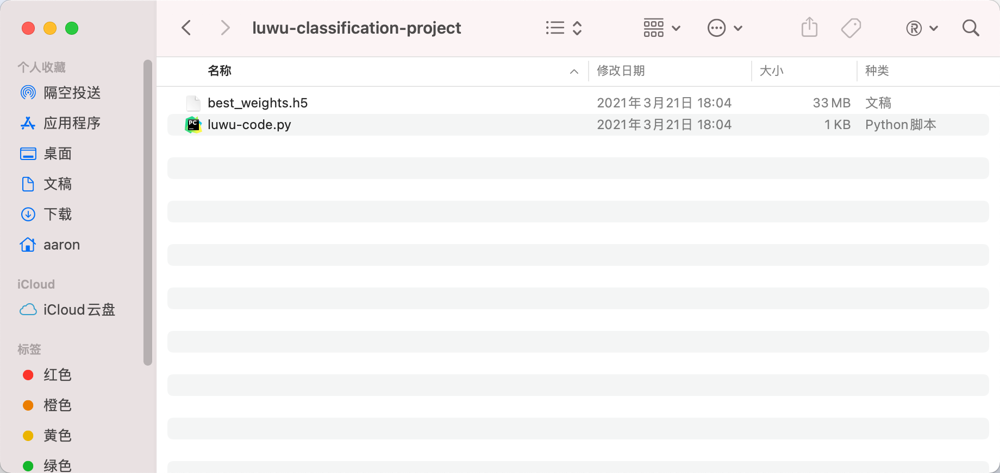

<!--
 * @Author       : AaronJny
 * @LastEditTime : 2021-03-26
 * @FilePath     : /LuWu/docs/六、[进阶用法]使用Kaggle加速训练.md
 * @Desc         : 
-->
# 六、[进阶用法]使用Kaggle加速训练

kaggle是什么？

> Kaggle是一个数据建模和数据分析竞赛平台。企业和研究者可在其上发布数据，统计学者和数据挖掘专家可在其上进行竞赛以产生最好的模型。这一众包模式依赖于这一事实，即有众多策略可以用于解决几乎所有预测建模的问题，而研究者不可能在一开始就了解什么方法对于特定问题是最为有效的。
> 
> 以上介绍来自于维基百科。

为了方便参赛者和数据工作者更好地使用Kaggle平台，kaggle为所有通过了手机号认证的用户免费提供每周30~43小时的GPU使用时间（型号为Nvidia Tesla P100）以及30小时的TPU使用时间。如果我们手头上没有合适的计算设备的话，借用Kaggle的免费算力是一个不错的选择。

而 `Luwu`，提供了对用户透明（不需要用户做任何额外操作，就和本地计算一样）的借用Kaggle GPU训练模型的功能。

注意，由于kaggle的限制，单次训练最多只能持续9小时，超时将强制终止。


使用`Luwu`的kaggle加速模式，需要拥有一个认证过手机号的kaggle账号。如果没有的话，我们需要先进行注册。

**注意，kaggle是国外的网站，可能需要使用网络代理。请确保你的网络能够访问google。**

## 1.注册kaggle账号并验证手机号

打开浏览器，输入`https://www.kaggle.com/`，进入kaggle官网，并点击`Register`注册账号。


可以选择使用Google账号注册，或者使用自己的邮箱注册。


我的google账号已经注册过了，这里为了方便演示，我用自己的其他邮箱注册：


从邮箱查收验证码，填入验证码，并`Next`：


好的，我们注册成功了！


我们需要验证手机号才能使用GPU，点击右上角的头像，进入`Account`页面：


然后点这里验证手机号：


验证之后，我们就有GPU使用额度了~

## 2.创建 kaggle api token

有了自己的账号后，还需要创建kaggle的api token。

接着上面的页面，看这里：


点击就会自动下载一个名为kaggle.json的文件，里面包含了token信息，只需要把这个文件复制到`~/.kaggle/`下即可（如果`~/.kaggle`不存在的话需要自行创建）。


比如我这里：


## 3.使用 luwu 的 kaggle 加速模式

实际上大家应该看到了，当我们输入`luwu classification -h`或者`luwu detection -h`时，都能够看到说明信息里有这么两个参数：

- --run_with_kaggle : 是否使用kaggle环境运行。必须先安装并配置kaggle api,才可以使用此选项。默认为False，即本地运行。
- --kaggle_accelerator : 是否使用kaggle GPU进行加速（注意，仅run_with_kaggle 为 True时此选项才有效）。默认不使用（即使用CPU）

怎么使用kaggle加速？

只需要给这两个参数都传递True即可，其他配置参数和本地训练保持一致即可。

比如第三节中的图像分类任务，如果要使用kaggle加速训练的话，我们可以输入这行命令：

```sh
luwu classification --origin_dataset_path /Users/aaron/cats-vs-dogs/data --model_save_path /Users/aaron/cats-vs-dogs --epochs 3 --validation_split 0.05 --do_fine_tune True --run_with_kaggle True --kaggle_accelerator True LuwuDenseNet121ImageClassifier
```

训练过程中的输出如下

```
Namespace(batch_size=8, cmd='classification', do_fine_tune=True, epochs=3, kaggle_accelerator=True, model_save_path='/Users/aaron/cats-vs-dogs', network_name='LuwuDenseNet121ImageClassifier', origin_dataset_path='/Users/aaron/cats-vs-dogs/data', project_id=0, run_with_kaggle=True, tfrecord_dataset_path='', validation_split=0.05)
2021-03-21 17:43:04.577 | INFO     | luwu.utils.file_util:get_tmp_dir:39 - 已创建临时文件夹 /Users/aaron/.luwu/tmp/1616319784/d58954f6-8a29-11eb-970c-3035ade0bfd6 .
2021-03-21 17:43:04.577 | INFO     | luwu.core.models.kaggle.kaggle:image_classification_entry:290 - [*][1]开始处理数据集...
2021-03-21 17:43:04.577 | INFO     | luwu.core.models.kaggle.kaggle:upload_dataset:53 - 创建文件夹 /Users/aaron/.luwu/tmp/1616319784/d58954f6-8a29-11eb-970c-3035ade0bfd6/kaggle-data/data ...
2021-03-21 17:43:04.578 | INFO     | luwu.core.models.kaggle.kaggle:upload_dataset:56 - 复制数据集到临时目录...
2021-03-21 17:43:31.051 | INFO     | luwu.core.models.kaggle.kaggle:upload_dataset:60 - 使用kaggle api初始化数据集...
Data package template written to: /Users/aaron/.luwu/tmp/1616319784/d58954f6-8a29-11eb-970c-3035ade0bfd6/kaggle-data/dataset-metadata.json
2021-03-21 17:43:31.511 | INFO     | luwu.core.models.kaggle.kaggle:upload_dataset:74 - 上传数据集...
Starting upload for file data.zip
 100%|████████████████████████████████████████████████████████████████████████████████████████████████████| 500M/500M [02:27<00:00, 3.55MB/s]
Upload successful: data.zip (500MB)
Your private Dataset is being created. Please check progress at https://www.kaggle.com/aaronjny7/luwu-dataset-d58954f6-8a29-11eb-970c-3035ade0bfd6
2021-03-21 17:46:21.782 | INFO     | luwu.core.models.kaggle.kaggle:upload_dataset:77 - 数据集上传完成！
2021-03-21 17:46:21.782 | INFO     | luwu.core.models.kaggle.kaggle:upload_dataset:78 - 等待 kaggle 处理数据集，这可能需要几分钟时间 ...
2021-03-21 17:46:24.298 | INFO     | luwu.core.models.kaggle.kaggle:upload_dataset:94 - 暂未查询到数据，等待中 ...
2021-03-21 17:46:36.891 | INFO     | luwu.core.models.kaggle.kaggle:upload_dataset:94 - 暂未查询到数据，等待中 ...
2021-03-21 17:46:52.119 | INFO     | luwu.core.models.kaggle.kaggle:upload_dataset:94 - 暂未查询到数据，等待中 ...
2021-03-21 17:47:03.468 | INFO     | luwu.core.models.kaggle.kaggle:upload_dataset:94 - 暂未查询到数据，等待中 ...
2021-03-21 17:47:15.138 | INFO     | luwu.core.models.kaggle.kaggle:upload_dataset:94 - 暂未查询到数据，等待中 ...
2021-03-21 17:47:26.596 | INFO     | luwu.core.models.kaggle.kaggle:upload_dataset:94 - 暂未查询到数据，等待中 ...
2021-03-21 17:47:39.907 | INFO     | luwu.core.models.kaggle.kaggle:upload_dataset:94 - 暂未查询到数据，等待中 ...
2021-03-21 17:47:52.083 | INFO     | luwu.core.models.kaggle.kaggle:upload_dataset:94 - 暂未查询到数据，等待中 ...
2021-03-21 17:48:03.529 | INFO     | luwu.core.models.kaggle.kaggle:upload_dataset:94 - 暂未查询到数据，等待中 ...
2021-03-21 17:48:17.631 | INFO     | luwu.core.models.kaggle.kaggle:upload_dataset:94 - 暂未查询到数据，等待中 ...
2021-03-21 17:48:30.208 | INFO     | luwu.core.models.kaggle.kaggle:upload_dataset:94 - 暂未查询到数据，等待中 ...
2021-03-21 17:48:43.182 | INFO     | luwu.core.models.kaggle.kaggle:upload_dataset:94 - 暂未查询到数据，等待中 ...
2021-03-21 17:48:54.726 | INFO     | luwu.core.models.kaggle.kaggle:upload_dataset:94 - 暂未查询到数据，等待中 ...
2021-03-21 17:49:06.503 | INFO     | luwu.core.models.kaggle.kaggle:upload_dataset:94 - 暂未查询到数据，等待中 ...
2021-03-21 17:49:21.843 | INFO     | luwu.core.models.kaggle.kaggle:upload_dataset:94 - 暂未查询到数据，等待中 ...
2021-03-21 17:49:33.595 | INFO     | luwu.core.models.kaggle.kaggle:upload_dataset:94 - 暂未查询到数据，等待中 ...
2021-03-21 17:49:45.240 | INFO     | luwu.core.models.kaggle.kaggle:upload_dataset:94 - 暂未查询到数据，等待中 ...
2021-03-21 17:49:56.794 | INFO     | luwu.core.models.kaggle.kaggle:upload_dataset:94 - 暂未查询到数据，等待中 ...
2021-03-21 17:50:08.760 | INFO     | luwu.core.models.kaggle.kaggle:upload_dataset:94 - 暂未查询到数据，等待中 ...
2021-03-21 17:50:20.207 | INFO     | luwu.core.models.kaggle.kaggle:upload_dataset:94 - 暂未查询到数据，等待中 ...
2021-03-21 17:50:31.971 | INFO     | luwu.core.models.kaggle.kaggle:upload_dataset:94 - 暂未查询到数据，等待中 ...
2021-03-21 17:50:43.427 | INFO     | luwu.core.models.kaggle.kaggle:upload_dataset:94 - 暂未查询到数据，等待中 ...
2021-03-21 17:50:55.179 | INFO     | luwu.core.models.kaggle.kaggle:upload_dataset:94 - 暂未查询到数据，等待中 ...
2021-03-21 17:51:08.176 | INFO     | luwu.core.models.kaggle.kaggle:upload_dataset:94 - 暂未查询到数据，等待中 ...
2021-03-21 17:51:20.647 | INFO     | luwu.core.models.kaggle.kaggle:upload_dataset:94 - 暂未查询到数据，等待中 ...
2021-03-21 17:51:32.203 | INFO     | luwu.core.models.kaggle.kaggle:upload_dataset:94 - 暂未查询到数据，等待中 ...
2021-03-21 17:51:43.652 | INFO     | luwu.core.models.kaggle.kaggle:upload_dataset:94 - 暂未查询到数据，等待中 ...
2021-03-21 17:51:57.581 | INFO     | luwu.core.models.kaggle.kaggle:upload_dataset:94 - 暂未查询到数据，等待中 ...
2021-03-21 17:52:09.031 | INFO     | luwu.core.models.kaggle.kaggle:upload_dataset:94 - 暂未查询到数据，等待中 ...
2021-03-21 17:52:20.490 | INFO     | luwu.core.models.kaggle.kaggle:upload_dataset:94 - 暂未查询到数据，等待中 ...
2021-03-21 17:52:34.100 | INFO     | luwu.core.models.kaggle.kaggle:upload_dataset:94 - 暂未查询到数据，等待中 ...
2021-03-21 17:52:45.363 | INFO     | luwu.core.models.kaggle.kaggle:upload_dataset:94 - 暂未查询到数据，等待中 ...
2021-03-21 17:52:57.197 | INFO     | luwu.core.models.kaggle.kaggle:upload_dataset:94 - 暂未查询到数据，等待中 ...
2021-03-21 17:53:08.570 | INFO     | luwu.core.models.kaggle.kaggle:upload_dataset:94 - 暂未查询到数据，等待中 ...
2021-03-21 17:53:19.757 | INFO     | luwu.core.models.kaggle.kaggle:upload_dataset:94 - 暂未查询到数据，等待中 ...
2021-03-21 17:53:31.149 | INFO     | luwu.core.models.kaggle.kaggle:upload_dataset:94 - 暂未查询到数据，等待中 ...
2021-03-21 17:53:44.670 | INFO     | luwu.core.models.kaggle.kaggle:upload_dataset:94 - 暂未查询到数据，等待中 ...
2021-03-21 17:53:56.460 | INFO     | luwu.core.models.kaggle.kaggle:upload_dataset:94 - 暂未查询到数据，等待中 ...
2021-03-21 17:54:08.178 | INFO     | luwu.core.models.kaggle.kaggle:upload_dataset:94 - 暂未查询到数据，等待中 ...
2021-03-21 17:54:20.962 | INFO     | luwu.core.models.kaggle.kaggle:upload_dataset:94 - 暂未查询到数据，等待中 ...
2021-03-21 17:54:33.308 | INFO     | luwu.core.models.kaggle.kaggle:upload_dataset:94 - 暂未查询到数据，等待中 ...
2021-03-21 17:54:44.601 | INFO     | luwu.core.models.kaggle.kaggle:upload_dataset:89 - 数据集准备完成！
2021-03-21 17:54:44.602 | INFO     | luwu.core.models.kaggle.kaggle:image_classification_entry:293 - [*][2]开始处理kernel...
2021-03-21 17:54:44.602 | INFO     | luwu.core.models.kaggle.kaggle:train_on_kaggle:105 - 创建文件夹 /Users/aaron/.luwu/tmp/1616319784/d58954f6-8a29-11eb-970c-3035ade0bfd6/kaggle-kernel ...
2021-03-21 17:54:44.602 | INFO     | luwu.core.models.kaggle.kaggle:train_on_kaggle:108 - 使用 kaggle api 初始化 kernel ...
Kernel metadata template written to: /Users/aaron/.luwu/tmp/1616319784/d58954f6-8a29-11eb-970c-3035ade0bfd6/kaggle-kernel/kernel-metadata.json
2021-03-21 17:54:44.918 | INFO     | luwu.core.models.kaggle.kaggle:train_on_kaggle:215 - kernel metadata :{'id': 'aaronjny7/luwu-kernel-d58954f6-8a29-11eb-970c-3035ade0bfd6', 'title': 'luwu-kernel-d58954f6-8a29-11eb-970c-3035ade0bfd6', 'code_file': '/Users/aaron/.luwu/tmp/1616319784/d58954f6-8a29-11eb-970c-3035ade0bfd6/kaggle-kernel/luwu-kernel-d58954f6-8a29-11eb-970c-3035ade0bfd6.ipynb', 'language': 'python', 'kernel_type': 'notebook', 'is_private': 'true', 'enable_gpu': 'true', 'enable_internet': 'true', 'dataset_sources': ['aaronjny7/luwu-dataset-d58954f6-8a29-11eb-970c-3035ade0bfd6'], 'competition_sources': [], 'kernel_sources': []}
2021-03-21 17:54:44.918 | INFO     | luwu.core.models.kaggle.kaggle:train_on_kaggle:219 - 将 kernel 推送到 Kaggle 并运行 ...
2021-03-21 17:54:44.919 | DEBUG    | luwu.core.models.kaggle.kaggle:train_on_kaggle:221 - kaggle kernels push -p /Users/aaron/.luwu/tmp/1616319784/d58954f6-8a29-11eb-970c-3035ade0bfd6/kaggle-kernel
Kernel version 1 successfully pushed.  Please check progress at https://www.kaggle.com/aaronjny7/luwu-kernel-d58954f6-8a29-11eb-970c-3035ade0bfd6
2021-03-21 17:54:47.799 | INFO     | luwu.core.models.kaggle.kaggle:train_on_kaggle:223 - 推送完成！等待运行中 ...
2021-03-21 17:54:49.627 | INFO     | luwu.core.models.kaggle.kaggle:train_on_kaggle:244 - aaronjny7/luwu-dataset-d58954f6-8a29-11eb-970c-3035ade0bfd6 running ...
2021-03-21 17:55:03.464 | INFO     | luwu.core.models.kaggle.kaggle:train_on_kaggle:249 - aaronjny7/luwu-dataset-d58954f6-8a29-11eb-970c-3035ade0bfd6 running ...
2021-03-21 17:55:14.756 | INFO     | luwu.core.models.kaggle.kaggle:train_on_kaggle:249 - aaronjny7/luwu-dataset-d58954f6-8a29-11eb-970c-3035ade0bfd6 running ...
2021-03-21 17:55:27.330 | INFO     | luwu.core.models.kaggle.kaggle:train_on_kaggle:249 - aaronjny7/luwu-dataset-d58954f6-8a29-11eb-970c-3035ade0bfd6 running ...
2021-03-21 17:55:38.876 | INFO     | luwu.core.models.kaggle.kaggle:train_on_kaggle:249 - aaronjny7/luwu-dataset-d58954f6-8a29-11eb-970c-3035ade0bfd6 running ...
2021-03-21 17:55:50.285 | INFO     | luwu.core.models.kaggle.kaggle:train_on_kaggle:249 - aaronjny7/luwu-dataset-d58954f6-8a29-11eb-970c-3035ade0bfd6 running ...
2021-03-21 17:56:01.777 | INFO     | luwu.core.models.kaggle.kaggle:train_on_kaggle:249 - aaronjny7/luwu-dataset-d58954f6-8a29-11eb-970c-3035ade0bfd6 running ...
2021-03-21 17:56:15.302 | INFO     | luwu.core.models.kaggle.kaggle:train_on_kaggle:249 - aaronjny7/luwu-dataset-d58954f6-8a29-11eb-970c-3035ade0bfd6 running ...
2021-03-21 17:56:27.523 | INFO     | luwu.core.models.kaggle.kaggle:train_on_kaggle:249 - aaronjny7/luwu-dataset-d58954f6-8a29-11eb-970c-3035ade0bfd6 running ...
2021-03-21 17:56:38.909 | INFO     | luwu.core.models.kaggle.kaggle:train_on_kaggle:249 - aaronjny7/luwu-dataset-d58954f6-8a29-11eb-970c-3035ade0bfd6 running ...
2021-03-21 17:56:50.693 | INFO     | luwu.core.models.kaggle.kaggle:train_on_kaggle:249 - aaronjny7/luwu-dataset-d58954f6-8a29-11eb-970c-3035ade0bfd6 running ...
2021-03-21 17:57:01.976 | INFO     | luwu.core.models.kaggle.kaggle:train_on_kaggle:249 - aaronjny7/luwu-dataset-d58954f6-8a29-11eb-970c-3035ade0bfd6 running ...
2021-03-21 17:57:13.145 | INFO     | luwu.core.models.kaggle.kaggle:train_on_kaggle:249 - aaronjny7/luwu-dataset-d58954f6-8a29-11eb-970c-3035ade0bfd6 running ...
2021-03-21 17:57:26.122 | INFO     | luwu.core.models.kaggle.kaggle:train_on_kaggle:249 - aaronjny7/luwu-dataset-d58954f6-8a29-11eb-970c-3035ade0bfd6 running ...
2021-03-21 17:57:37.520 | INFO     | luwu.core.models.kaggle.kaggle:train_on_kaggle:249 - aaronjny7/luwu-dataset-d58954f6-8a29-11eb-970c-3035ade0bfd6 running ...
2021-03-21 17:57:48.945 | INFO     | luwu.core.models.kaggle.kaggle:train_on_kaggle:249 - aaronjny7/luwu-dataset-d58954f6-8a29-11eb-970c-3035ade0bfd6 running ...
2021-03-21 17:58:00.855 | INFO     | luwu.core.models.kaggle.kaggle:train_on_kaggle:249 - aaronjny7/luwu-dataset-d58954f6-8a29-11eb-970c-3035ade0bfd6 running ...
2021-03-21 17:58:12.140 | INFO     | luwu.core.models.kaggle.kaggle:train_on_kaggle:249 - aaronjny7/luwu-dataset-d58954f6-8a29-11eb-970c-3035ade0bfd6 running ...
2021-03-21 17:58:23.422 | INFO     | luwu.core.models.kaggle.kaggle:train_on_kaggle:249 - aaronjny7/luwu-dataset-d58954f6-8a29-11eb-970c-3035ade0bfd6 running ...
2021-03-21 17:58:35.233 | INFO     | luwu.core.models.kaggle.kaggle:train_on_kaggle:249 - aaronjny7/luwu-dataset-d58954f6-8a29-11eb-970c-3035ade0bfd6 running ...
2021-03-21 17:58:46.495 | INFO     | luwu.core.models.kaggle.kaggle:train_on_kaggle:249 - aaronjny7/luwu-dataset-d58954f6-8a29-11eb-970c-3035ade0bfd6 running ...
2021-03-21 17:58:58.625 | INFO     | luwu.core.models.kaggle.kaggle:train_on_kaggle:249 - aaronjny7/luwu-dataset-d58954f6-8a29-11eb-970c-3035ade0bfd6 running ...
2021-03-21 17:59:10.120 | INFO     | luwu.core.models.kaggle.kaggle:train_on_kaggle:249 - aaronjny7/luwu-dataset-d58954f6-8a29-11eb-970c-3035ade0bfd6 running ...
2021-03-21 17:59:21.927 | INFO     | luwu.core.models.kaggle.kaggle:train_on_kaggle:249 - aaronjny7/luwu-dataset-d58954f6-8a29-11eb-970c-3035ade0bfd6 running ...
2021-03-21 17:59:33.423 | INFO     | luwu.core.models.kaggle.kaggle:train_on_kaggle:249 - aaronjny7/luwu-dataset-d58954f6-8a29-11eb-970c-3035ade0bfd6 running ...
2021-03-21 17:59:45.133 | INFO     | luwu.core.models.kaggle.kaggle:train_on_kaggle:249 - aaronjny7/luwu-dataset-d58954f6-8a29-11eb-970c-3035ade0bfd6 running ...
2021-03-21 18:00:00.333 | INFO     | luwu.core.models.kaggle.kaggle:train_on_kaggle:249 - aaronjny7/luwu-dataset-d58954f6-8a29-11eb-970c-3035ade0bfd6 running ...
2021-03-21 18:00:11.728 | INFO     | luwu.core.models.kaggle.kaggle:train_on_kaggle:249 - aaronjny7/luwu-dataset-d58954f6-8a29-11eb-970c-3035ade0bfd6 running ...
2021-03-21 18:00:27.673 | INFO     | luwu.core.models.kaggle.kaggle:train_on_kaggle:249 - aaronjny7/luwu-dataset-d58954f6-8a29-11eb-970c-3035ade0bfd6 running ...
2021-03-21 18:00:39.061 | INFO     | luwu.core.models.kaggle.kaggle:train_on_kaggle:249 - aaronjny7/luwu-dataset-d58954f6-8a29-11eb-970c-3035ade0bfd6 running ...
2021-03-21 18:00:50.655 | INFO     | luwu.core.models.kaggle.kaggle:train_on_kaggle:249 - aaronjny7/luwu-dataset-d58954f6-8a29-11eb-970c-3035ade0bfd6 running ...
2021-03-21 18:01:03.143 | INFO     | luwu.core.models.kaggle.kaggle:train_on_kaggle:249 - aaronjny7/luwu-dataset-d58954f6-8a29-11eb-970c-3035ade0bfd6 running ...
2021-03-21 18:01:16.238 | INFO     | luwu.core.models.kaggle.kaggle:train_on_kaggle:249 - aaronjny7/luwu-dataset-d58954f6-8a29-11eb-970c-3035ade0bfd6 running ...
2021-03-21 18:01:29.858 | INFO     | luwu.core.models.kaggle.kaggle:train_on_kaggle:249 - aaronjny7/luwu-dataset-d58954f6-8a29-11eb-970c-3035ade0bfd6 running ...
2021-03-21 18:01:41.336 | INFO     | luwu.core.models.kaggle.kaggle:train_on_kaggle:249 - aaronjny7/luwu-dataset-d58954f6-8a29-11eb-970c-3035ade0bfd6 running ...
2021-03-21 18:01:56.534 | INFO     | luwu.core.models.kaggle.kaggle:train_on_kaggle:249 - aaronjny7/luwu-dataset-d58954f6-8a29-11eb-970c-3035ade0bfd6 running ...
2021-03-21 18:02:09.415 | INFO     | luwu.core.models.kaggle.kaggle:train_on_kaggle:249 - aaronjny7/luwu-dataset-d58954f6-8a29-11eb-970c-3035ade0bfd6 running ...
2021-03-21 18:02:22.733 | INFO     | luwu.core.models.kaggle.kaggle:train_on_kaggle:249 - aaronjny7/luwu-dataset-d58954f6-8a29-11eb-970c-3035ade0bfd6 running ...
2021-03-21 18:02:34.226 | INFO     | luwu.core.models.kaggle.kaggle:train_on_kaggle:249 - aaronjny7/luwu-dataset-d58954f6-8a29-11eb-970c-3035ade0bfd6 running ...
2021-03-21 18:02:46.659 | INFO     | luwu.core.models.kaggle.kaggle:train_on_kaggle:249 - aaronjny7/luwu-dataset-d58954f6-8a29-11eb-970c-3035ade0bfd6 running ...
2021-03-21 18:02:58.050 | INFO     | luwu.core.models.kaggle.kaggle:train_on_kaggle:249 - aaronjny7/luwu-dataset-d58954f6-8a29-11eb-970c-3035ade0bfd6 running ...
2021-03-21 18:03:09.438 | INFO     | luwu.core.models.kaggle.kaggle:train_on_kaggle:249 - aaronjny7/luwu-dataset-d58954f6-8a29-11eb-970c-3035ade0bfd6 running ...
2021-03-21 18:03:20.836 | INFO     | luwu.core.models.kaggle.kaggle:train_on_kaggle:249 - aaronjny7/luwu-dataset-d58954f6-8a29-11eb-970c-3035ade0bfd6 running ...
2021-03-21 18:03:32.024 | INFO     | luwu.core.models.kaggle.kaggle:train_on_kaggle:249 - aaronjny7/luwu-dataset-d58954f6-8a29-11eb-970c-3035ade0bfd6 running ...
2021-03-21 18:03:43.621 | INFO     | luwu.core.models.kaggle.kaggle:train_on_kaggle:249 - aaronjny7/luwu-dataset-d58954f6-8a29-11eb-970c-3035ade0bfd6 running ...
2021-03-21 18:03:55.022 | INFO     | luwu.core.models.kaggle.kaggle:train_on_kaggle:249 - aaronjny7/luwu-dataset-d58954f6-8a29-11eb-970c-3035ade0bfd6 running ...
2021-03-21 18:04:06.402 | INFO     | luwu.core.models.kaggle.kaggle:train_on_kaggle:249 - aaronjny7/luwu-dataset-d58954f6-8a29-11eb-970c-3035ade0bfd6 running ...
2021-03-21 18:04:17.685 | INFO     | luwu.core.models.kaggle.kaggle:train_on_kaggle:249 - aaronjny7/luwu-dataset-d58954f6-8a29-11eb-970c-3035ade0bfd6 running ...
2021-03-21 18:04:30.896 | INFO     | luwu.core.models.kaggle.kaggle:train_on_kaggle:252 - aaronjny7/luwu-kernel-d58954f6-8a29-11eb-970c-3035ade0bfd6 has status "complete"
2021-03-21 18:04:30.896 | INFO     | luwu.core.models.kaggle.kaggle:train_on_kaggle:254 - aaronjny7/luwu-dataset-d58954f6-8a29-11eb-970c-3035ade0bfd6 终止状态：complete . 已退出！
2021-03-21 18:04:30.897 | INFO     | luwu.core.models.kaggle.kaggle:train_on_kaggle:258 - kernel 运行已结束！
2021-03-21 18:04:30.897 | INFO     | luwu.core.models.kaggle.kaggle:image_classification_entry:296 - [*][3]开始拉取运行结果...
2021-03-21 18:04:30.897 | INFO     | luwu.core.models.kaggle.kaggle:download_result_from_kaggle:262 - 创建文件夹 /Users/aaron/.luwu/tmp/1616319784/d58954f6-8a29-11eb-970c-3035ade0bfd6/kaggle-output ...
2021-03-21 18:04:30.897 | INFO     | luwu.core.models.kaggle.kaggle:download_result_from_kaggle:264 - 从kaggle拉取运行结果...
Output file downloaded to /Users/aaron/.luwu/tmp/1616319784/d58954f6-8a29-11eb-970c-3035ade0bfd6/kaggle-output/luwu-classification-project-d58954f6-8a29-11eb-970c-3035ade0bfd6.zip
Kernel log downloaded to /Users/aaron/.luwu/tmp/1616319784/d58954f6-8a29-11eb-970c-3035ade0bfd6/kaggle-output/luwu-kernel-d58954f6-8a29-11eb-970c-3035ade0bfd6.log
2021-03-21 18:04:39.033 | INFO     | luwu.core.models.kaggle.kaggle:download_result_from_kaggle:273 - 将运行结果移动到指定目录 /Users/aaron/cats-vs-dogs ...
2021-03-21 18:04:39.066 | INFO     | luwu.core.models.kaggle.kaggle:download_result_from_kaggle:276 - Done.
2021-03-21 18:04:39.067 | INFO     | luwu.core.models.kaggle.kaggle:image_classification_entry:299 - [*][4]清理临时文件...
2021-03-21 18:04:41.274 | INFO     | luwu.core.models.kaggle.kaggle:image_classification_entry:301 - [*]完成！
```

数据上传、训练、下载等等共花费了20分钟，其中纯训练部分耗时不到10分钟，Kaggle的GPU还算给力。毕竟免费的，还要啥自行车？=。=

打开`/Users/aaron/cats-vs-dogs`目录：


其中，`luwu-kernel-d58954f6-8a29-11eb-970c-3035ade0bfd6.log`是训练过程中kaggle上notebook输出的日志，不过本地查看的效果不太好，有需要的话建议去kaggle上面查看(在训练过程中会输出notebook在kaggle上的地址，比如这里是`https://www.kaggle.com/aaronjny7/luwu-kernel-d58954f6-8a29-11eb-970c-3035ade0bfd6`)。

`luwu-classification-project-d58954f6-8a29-11eb-970c-3035ade0bfd6.zip`是训练结果，解压它：



`best_weights.h5`是训练好的模型，`luwu-code.py`是示例调用代码。
